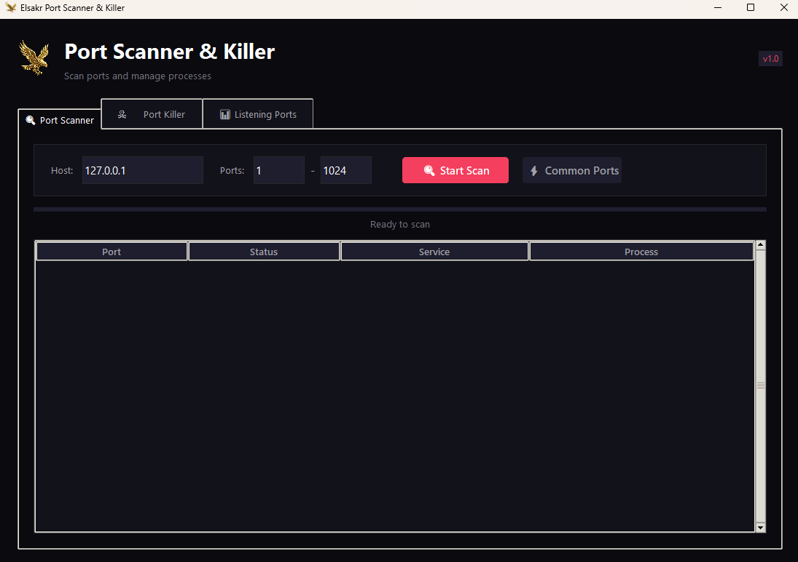

# 🔍 Elsakr Port Scanner & Killer

<p align="center">
  
</p>

<p align="center">
  <strong>Scan ports and kill processes using them</strong>
</p>

<p align="center">
  
  
  
</p>

---

## ✨ Features

### 🔍 Port Scanner
- Scan any port range (1-65535)
- Multi-threaded for speed (100 threads)
- Quick scan for common ports
- Shows service name and process info
- Real-time progress tracking

### ☠️ Port Killer
- Kill any process by port number
- Quick kill buttons for dev ports (3000, 5000, 8000, etc.)
- Process name and PID display
- Confirmation before killing

### 📊 Listening Ports
- View all listening ports on your machine
- See process name, PID, and service
- Double-click to kill process

---

## 📸 Screenshot

<p align="center">
  
</p>

---

## 🚀 Quick Start

### Run from Source

```bash
# Clone the repository
git clone https://github.com/khalidsakrjoker/elsakr-port-scanner.git
cd elsakr-port-scanner

# Create virtual environment
python -m venv venv
.\venv\Scripts\Activate  # Windows

# Install dependencies
pip install -r requirements.txt

# Run the app
python main.py
```

### Download EXE

Download from [Releases](https://github.com/khalidsakrjoker/elsakr-port-scanner/releases).

---

## 🛠️ Build Executable

```bash
pip install pyinstaller

pyinstaller --noconsole --onefile --icon="assets/fav.ico" --name="Elsakr Port Scanner" --add-data "assets;assets" main.py
```

---

## ⚠️ Note

- **Run as Administrator** for full functionality (killing system processes)
- This tool uses Windows-specific commands (netstat, taskkill)

---

## 📄 License

MIT License - [Elsakr Software](https://elsakr.company)

---

<p align="center">
  Made with ❤️ by <a href="https://elsakr.company">Elsakr</a>
</p>
